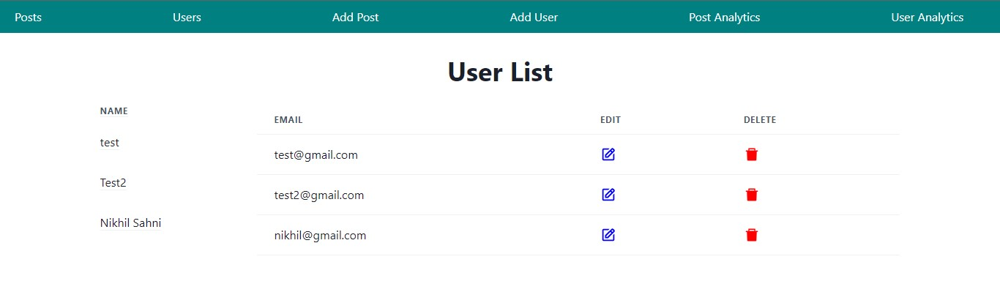
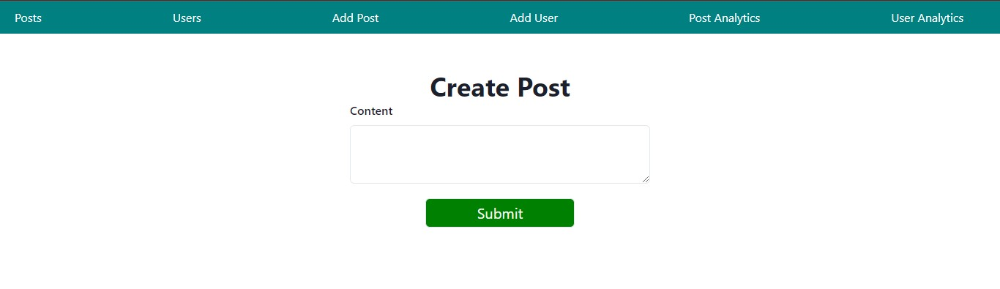
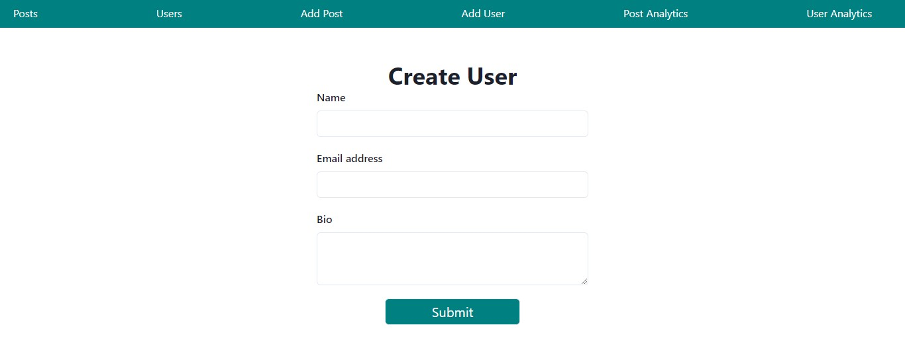
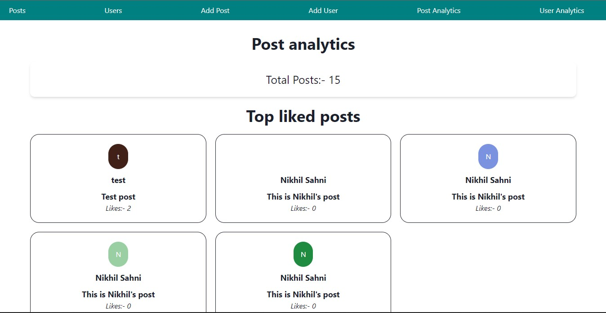
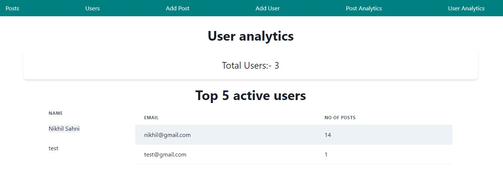

## Hello Everyone 😊

This is an assignment from adobe which is an social network app

## About Website

It is an social media website in which user can create,like,unlike,delete and edit posts and users. Also users can see analytics of users and posts

## Tech Stacks

- React Js
- Node JS
- Express JS

## External libraries an frameworks

- Chakra UI

## Features

- Responsive UI
- Create User functionality
- Create post
- Edit, Delete Like and unlike post functionality
- Edit and Delete user functionality

## Deployed Link

[https://adode.vercel.app/]

## Set up and run project locally

- clone the repository by following command :- git clone https://github.com/snikhil2001/adobe-assignment.git
- npm install
- npm start

## Pics of UI

## Run backend locally

-clone the repository by following command :- git clone https://github.com/snikhil2001/adobe-assignment.git
-npm install
-npm run dev

## Run test cases

- after cloning the repository and installing - npm run test
